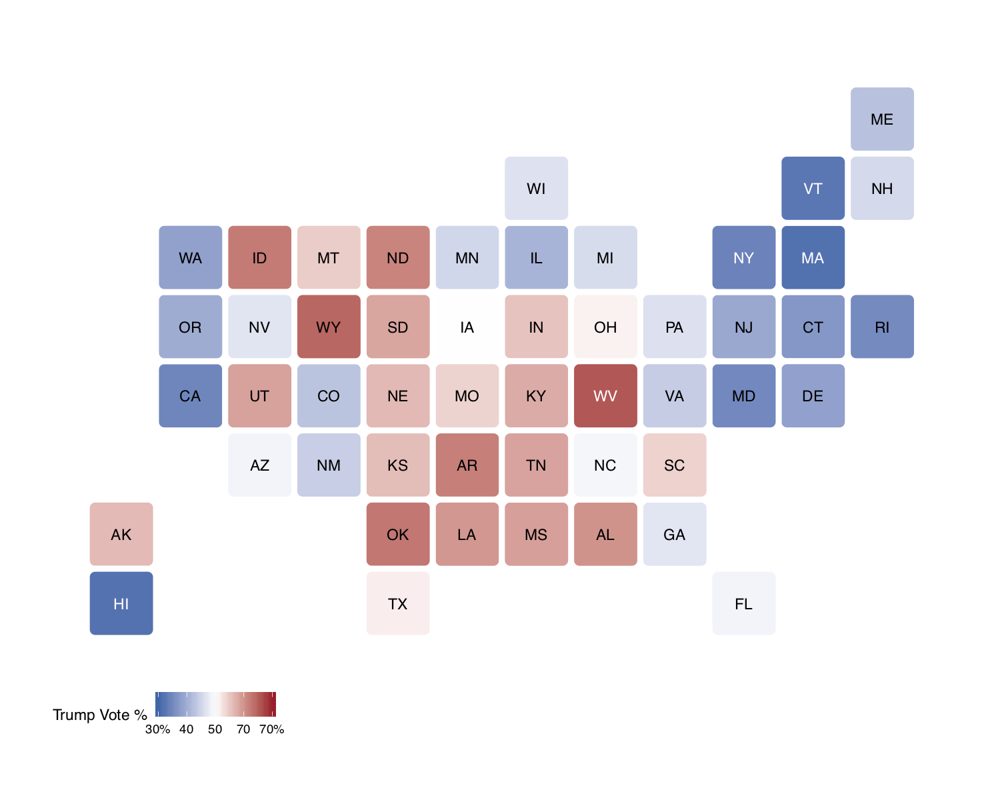

# Welcome! 

This webpage is a collection of election analytics blogs made by student forecasters in the course Gov 1347 at Harvard University (taught by Ryan Enos with teaching fellows Soubhik Barari and Sun Young Park). 

The goal of these blogs is to provide **descriptive analyses and regularly updated predictions around the outcome of the 2020 presidential election**. Forecasters use rigorous quantitative and statistical methods and political reseach to make scientifically-informed commentary around different facets of the race (e.g., the economy, ad campaigns). 

## Summary of forecasts

<h4><b>Figure 1: Distribution of Electoral College Forecasts</b></h4>

<figcaption>The Amazon Rainforest contains a multitude of species and is vital to the Earth's survival.</figcaption>

<figcaption>The Amazon Rainforest contains a multitude of species and is vital to the Earth's survival.</figcaption>

<figcaption>The Amazon Rainforest contains a multitude of species and is vital to the Earth's survival.</figcaption>

<table>
 <thead>
  <tr>
   <th style="text-align:left;"> State </th>
   <th style="text-align:right;"> Mean </th>
   <th style="text-align:right;"> Median </th>
   <th style="text-align:right;"> Min </th>
   <th style="text-align:right;"> Max </th>
  </tr>
 </thead>
<tbody>
  <tr>
   <td style="text-align:left;"> Alabama </td>
   <td style="text-align:right;"> 60.03 </td>
   <td style="text-align:right;"> 60.10 </td>
   <td style="text-align:right;"> 45.90 </td>
   <td style="text-align:right;"> 72.00 </td>
  </tr>
  <tr>
   <td style="text-align:left;"> Alaska </td>
   <td style="text-align:right;"> 56.23 </td>
   <td style="text-align:right;"> 54.90 </td>
   <td style="text-align:right;"> 49.00 </td>
   <td style="text-align:right;"> 68.00 </td>
  </tr>
  <tr>
   <td style="text-align:left;"> Arizona </td>
   <td style="text-align:right;"> 48.66 </td>
   <td style="text-align:right;"> 48.80 </td>
   <td style="text-align:right;"> 39.90 </td>
   <td style="text-align:right;"> 53.00 </td>
  </tr>
  <tr>
   <td style="text-align:left;"> Arkansas </td>
   <td style="text-align:right;"> 61.84 </td>
   <td style="text-align:right;"> 61.70 </td>
   <td style="text-align:right;"> 49.30 </td>
   <td style="text-align:right;"> 87.00 </td>
  </tr>
  <tr>
   <td style="text-align:left;"> California </td>
   <td style="text-align:right;"> 34.64 </td>
   <td style="text-align:right;"> 35.04 </td>
   <td style="text-align:right;"> 17.00 </td>
   <td style="text-align:right;"> 40.55 </td>
  </tr>
  <tr>
   <td style="text-align:left;"> Colorado </td>
   <td style="text-align:right;"> 42.86 </td>
   <td style="text-align:right;"> 43.00 </td>
   <td style="text-align:right;"> 38.00 </td>
   <td style="text-align:right;"> 48.00 </td>
  </tr>
  <tr>
   <td style="text-align:left;"> Connecticut </td>
   <td style="text-align:right;"> 36.94 </td>
   <td style="text-align:right;"> 36.90 </td>
   <td style="text-align:right;"> 25.00 </td>
   <td style="text-align:right;"> 43.10 </td>
  </tr>
  <tr>
   <td style="text-align:left;"> Delaware </td>
   <td style="text-align:right;"> 38.37 </td>
   <td style="text-align:right;"> 37.40 </td>
   <td style="text-align:right;"> 33.00 </td>
   <td style="text-align:right;"> 49.90 </td>
  </tr>
  <tr>
   <td style="text-align:left;"> District of Columbia </td>
   <td style="text-align:right;"> 9.74 </td>
   <td style="text-align:right;"> 7.00 </td>
   <td style="text-align:right;"> 0.00 </td>
   <td style="text-align:right;"> 50.57 </td>
  </tr>
  <tr>
   <td style="text-align:left;"> Florida </td>
   <td style="text-align:right;"> 48.68 </td>
   <td style="text-align:right;"> 48.60 </td>
   <td style="text-align:right;"> 44.00 </td>
   <td style="text-align:right;"> 52.10 </td>
  </tr>
  <tr>
   <td style="text-align:left;"> Georgia </td>
   <td style="text-align:right;"> 46.99 </td>
   <td style="text-align:right;"> 49.50 </td>
   <td style="text-align:right;"> 4.00 </td>
   <td style="text-align:right;"> 52.90 </td>
  </tr>
  <tr>
   <td style="text-align:left;"> Hawaii </td>
   <td style="text-align:right;"> 31.95 </td>
   <td style="text-align:right;"> 33.06 </td>
   <td style="text-align:right;"> 6.00 </td>
   <td style="text-align:right;"> 39.15 </td>
  </tr>
  <tr>
   <td style="text-align:left;"> Idaho </td>
   <td style="text-align:right;"> 62.29 </td>
   <td style="text-align:right;"> 62.00 </td>
   <td style="text-align:right;"> 54.30 </td>
   <td style="text-align:right;"> 82.00 </td>
  </tr>
  <tr>
   <td style="text-align:left;"> Illinois </td>
   <td style="text-align:right;"> 40.80 </td>
   <td style="text-align:right;"> 40.90 </td>
   <td style="text-align:right;"> 34.00 </td>
   <td style="text-align:right;"> 44.59 </td>
  </tr>
  <tr>
   <td style="text-align:left;"> Indiana </td>
   <td style="text-align:right;"> 55.51 </td>
   <td style="text-align:right;"> 55.30 </td>
   <td style="text-align:right;"> 48.10 </td>
   <td style="text-align:right;"> 62.00 </td>
  </tr>
  <tr>
   <td style="text-align:left;"> Iowa </td>
   <td style="text-align:right;"> 50.05 </td>
   <td style="text-align:right;"> 50.40 </td>
   <td style="text-align:right;"> 41.10 </td>
   <td style="text-align:right;"> 53.50 </td>
  </tr>
  <tr>
   <td style="text-align:left;"> Kansas </td>
   <td style="text-align:right;"> 56.06 </td>
   <td style="text-align:right;"> 56.30 </td>
   <td style="text-align:right;"> 50.30 </td>
   <td style="text-align:right;"> 66.00 </td>
  </tr>
  <tr>
   <td style="text-align:left;"> Kentucky </td>
   <td style="text-align:right;"> 57.63 </td>
   <td style="text-align:right;"> 58.90 </td>
   <td style="text-align:right;"> 24.00 </td>
   <td style="text-align:right;"> 65.00 </td>
  </tr>
  <tr>
   <td style="text-align:left;"> Louisiana </td>
   <td style="text-align:right;"> 59.63 </td>
   <td style="text-align:right;"> 58.70 </td>
   <td style="text-align:right;"> 52.30 </td>
   <td style="text-align:right;"> 78.00 </td>
  </tr>
  <tr>
   <td style="text-align:left;"> Maine </td>
   <td style="text-align:right;"> 42.61 </td>
   <td style="text-align:right;"> 43.00 </td>
   <td style="text-align:right;"> 32.00 </td>
   <td style="text-align:right;"> 46.90 </td>
  </tr>
  <tr>
   <td style="text-align:left;"> Maryland </td>
   <td style="text-align:right;"> 35.01 </td>
   <td style="text-align:right;"> 34.47 </td>
   <td style="text-align:right;"> 23.00 </td>
   <td style="text-align:right;"> 48.40 </td>
  </tr>
  <tr>
   <td style="text-align:left;"> Massachusetts </td>
   <td style="text-align:right;"> 31.68 </td>
   <td style="text-align:right;"> 31.10 </td>
   <td style="text-align:right;"> 13.00 </td>
   <td style="text-align:right;"> 48.10 </td>
  </tr>
  <tr>
   <td style="text-align:left;"> Michigan </td>
   <td style="text-align:right;"> 45.89 </td>
   <td style="text-align:right;"> 46.20 </td>
   <td style="text-align:right;"> 39.00 </td>
   <td style="text-align:right;"> 49.40 </td>
  </tr>
  <tr>
   <td style="text-align:left;"> Minnesota </td>
   <td style="text-align:right;"> 45.22 </td>
   <td style="text-align:right;"> 45.90 </td>
   <td style="text-align:right;"> 38.00 </td>
   <td style="text-align:right;"> 49.80 </td>
  </tr>
  <tr>
   <td style="text-align:left;"> Mississippi </td>
   <td style="text-align:right;"> 58.81 </td>
   <td style="text-align:right;"> 58.20 </td>
   <td style="text-align:right;"> 53.80 </td>
   <td style="text-align:right;"> 66.00 </td>
  </tr>
  <tr>
   <td style="text-align:left;"> Missouri </td>
   <td style="text-align:right;"> 53.99 </td>
   <td style="text-align:right;"> 54.00 </td>
   <td style="text-align:right;"> 45.60 </td>
   <td style="text-align:right;"> 60.30 </td>
  </tr>
  <tr>
   <td style="text-align:left;"> Montana </td>
   <td style="text-align:right;"> 54.65 </td>
   <td style="text-align:right;"> 54.30 </td>
   <td style="text-align:right;"> 49.00 </td>
   <td style="text-align:right;"> 61.50 </td>
  </tr>
  <tr>
   <td style="text-align:left;"> Nebraska </td>
   <td style="text-align:right;"> 56.33 </td>
   <td style="text-align:right;"> 57.05 </td>
   <td style="text-align:right;"> 42.00 </td>
   <td style="text-align:right;"> 63.40 </td>
  </tr>
  <tr>
   <td style="text-align:left;"> Nevada </td>
   <td style="text-align:right;"> 46.89 </td>
   <td style="text-align:right;"> 47.10 </td>
   <td style="text-align:right;"> 38.00 </td>
   <td style="text-align:right;"> 54.50 </td>
  </tr>
  <tr>
   <td style="text-align:left;"> New Hampshire </td>
   <td style="text-align:right;"> 45.52 </td>
   <td style="text-align:right;"> 45.38 </td>
   <td style="text-align:right;"> 42.00 </td>
   <td style="text-align:right;"> 51.40 </td>
  </tr>
  <tr>
   <td style="text-align:left;"> New Jersey </td>
   <td style="text-align:right;"> 39.30 </td>
   <td style="text-align:right;"> 39.00 </td>
   <td style="text-align:right;"> 26.00 </td>
   <td style="text-align:right;"> 53.10 </td>
  </tr>
  <tr>
   <td style="text-align:left;"> New Mexico </td>
   <td style="text-align:right;"> 44.16 </td>
   <td style="text-align:right;"> 44.30 </td>
   <td style="text-align:right;"> 36.00 </td>
   <td style="text-align:right;"> 49.50 </td>
  </tr>
  <tr>
   <td style="text-align:left;"> New York </td>
   <td style="text-align:right;"> 34.19 </td>
   <td style="text-align:right;"> 34.30 </td>
   <td style="text-align:right;"> 18.00 </td>
   <td style="text-align:right;"> 45.30 </td>
  </tr>
  <tr>
   <td style="text-align:left;"> North Carolina </td>
   <td style="text-align:right;"> 48.90 </td>
   <td style="text-align:right;"> 49.20 </td>
   <td style="text-align:right;"> 44.00 </td>
   <td style="text-align:right;"> 51.60 </td>
  </tr>
  <tr>
   <td style="text-align:left;"> North Dakota </td>
   <td style="text-align:right;"> 61.44 </td>
   <td style="text-align:right;"> 60.40 </td>
   <td style="text-align:right;"> 54.00 </td>
   <td style="text-align:right;"> 72.00 </td>
  </tr>
  <tr>
   <td style="text-align:left;"> Ohio </td>
   <td style="text-align:right;"> 51.23 </td>
   <td style="text-align:right;"> 51.00 </td>
   <td style="text-align:right;"> 44.00 </td>
   <td style="text-align:right;"> 55.00 </td>
  </tr>
  <tr>
   <td style="text-align:left;"> Oklahoma </td>
   <td style="text-align:right;"> 62.64 </td>
   <td style="text-align:right;"> 62.20 </td>
   <td style="text-align:right;"> 57.00 </td>
   <td style="text-align:right;"> 75.00 </td>
  </tr>
  <tr>
   <td style="text-align:left;"> Oregon </td>
   <td style="text-align:right;"> 39.92 </td>
   <td style="text-align:right;"> 40.03 </td>
   <td style="text-align:right;"> 31.00 </td>
   <td style="text-align:right;"> 46.00 </td>
  </tr>
  <tr>
   <td style="text-align:left;"> Pennsylvania </td>
   <td style="text-align:right;"> 46.39 </td>
   <td style="text-align:right;"> 47.40 </td>
   <td style="text-align:right;"> 36.40 </td>
   <td style="text-align:right;"> 49.30 </td>
  </tr>
  <tr>
   <td style="text-align:left;"> Rhode Island </td>
   <td style="text-align:right;"> 35.27 </td>
   <td style="text-align:right;"> 33.90 </td>
   <td style="text-align:right;"> 29.00 </td>
   <td style="text-align:right;"> 49.60 </td>
  </tr>
  <tr>
   <td style="text-align:left;"> South Carolina </td>
   <td style="text-align:right;"> 54.12 </td>
   <td style="text-align:right;"> 54.00 </td>
   <td style="text-align:right;"> 47.20 </td>
   <td style="text-align:right;"> 62.00 </td>
  </tr>
  <tr>
   <td style="text-align:left;"> South Dakota </td>
   <td style="text-align:right;"> 58.27 </td>
   <td style="text-align:right;"> 57.80 </td>
   <td style="text-align:right;"> 52.00 </td>
   <td style="text-align:right;"> 65.00 </td>
  </tr>
  <tr>
   <td style="text-align:left;"> Tennessee </td>
   <td style="text-align:right;"> 58.42 </td>
   <td style="text-align:right;"> 58.30 </td>
   <td style="text-align:right;"> 46.50 </td>
   <td style="text-align:right;"> 72.00 </td>
  </tr>
  <tr>
   <td style="text-align:left;"> Texas </td>
   <td style="text-align:right;"> 51.47 </td>
   <td style="text-align:right;"> 51.20 </td>
   <td style="text-align:right;"> 46.00 </td>
   <td style="text-align:right;"> 56.00 </td>
  </tr>
  <tr>
   <td style="text-align:left;"> Utah </td>
   <td style="text-align:right;"> 58.61 </td>
   <td style="text-align:right;"> 58.70 </td>
   <td style="text-align:right;"> 51.00 </td>
   <td style="text-align:right;"> 73.00 </td>
  </tr>
  <tr>
   <td style="text-align:left;"> Vermont </td>
   <td style="text-align:right;"> 32.48 </td>
   <td style="text-align:right;"> 31.70 </td>
   <td style="text-align:right;"> 19.00 </td>
   <td style="text-align:right;"> 46.93 </td>
  </tr>
  <tr>
   <td style="text-align:left;"> Virginia </td>
   <td style="text-align:right;"> 43.90 </td>
   <td style="text-align:right;"> 44.00 </td>
   <td style="text-align:right;"> 35.57 </td>
   <td style="text-align:right;"> 53.50 </td>
  </tr>
  <tr>
   <td style="text-align:left;"> Washington </td>
   <td style="text-align:right;"> 38.51 </td>
   <td style="text-align:right;"> 38.10 </td>
   <td style="text-align:right;"> 25.00 </td>
   <td style="text-align:right;"> 48.30 </td>
  </tr>
  <tr>
   <td style="text-align:left;"> West Virginia </td>
   <td style="text-align:right;"> 65.66 </td>
   <td style="text-align:right;"> 64.34 </td>
   <td style="text-align:right;"> 56.10 </td>
   <td style="text-align:right;"> 92.00 </td>
  </tr>
  <tr>
   <td style="text-align:left;"> Wisconsin </td>
   <td style="text-align:right;"> 46.56 </td>
   <td style="text-align:right;"> 46.60 </td>
   <td style="text-align:right;"> 39.00 </td>
   <td style="text-align:right;"> 57.00 </td>
  </tr>
  <tr>
   <td style="text-align:left;"> Wyoming </td>
   <td style="text-align:right;"> 64.19 </td>
   <td style="text-align:right;"> 67.80 </td>
   <td style="text-align:right;"> 1.00 </td>
   <td style="text-align:right;"> 75.50 </td>
  </tr>
</tbody>
</table>

## Forecaster blogs

* [Alison Hu](http://ahu6.github.io/electionanalytics), Sophomore in Applied Math / Economics
* [Brendan Chapuis](https://bchaps1999.github.io/2020_election_analytics/), Junior in Economics
* [Carine Hajjar](https://carine-h.github.io/), Senior in Government (Data Science)
* [Cassidy Bargell](https://cassidybargell.github.io/election_analytics/), Junior in Integrative Biology
* [Christopher Milne](https://camilne9.github.io/election_analytics_blog/), Junior in Physics
* [Dominic Skinnion](https://dskinnion.github.io/Gov1347_Blog/), Sophomore in Government
* [Elias DeLeon](https://juggereggnog.github.io/Election-Analytics-Blog/), Sophomore in Philosophy / Government
* [Ella Michaels](https://ellamichaels.github.io/gov1347_blog/), Junior in Government
* [Eric White](https://eric-white2021.github.io/gov1347blog/), Senior in Applied Math
* [Erin Guetzloe](https://eguetzloe.github.io/Election-Analytics-Blog/), Sophomore in Government (Data Science) and Philosophy
* [Evangelos Kasus](https://ekassos.github.io/election-analytics/), Sophomore in Government
* [Evelyn Cai](http://caievelyn.github.io/election-analytics), Junior in Government
* [Feven Yohannes](https://fyohannes.github.io/Data_Elections/), Junior in Government
* [Grace Kim](https://gkim65.github.io/2020_ElectionBlogPost_gov1347/), Mechanical Engineering/Government (Data Science)
* [Jack Schroeder](https://jackmschroeder.github.io/Election-Analytics/), Senior in Government
* [Kayla Manning](https://kayla-manning.github.io/gov1347/), Sophomore in Statistics
* [Lindsey Greenhill](https://lindseygreenhill.github.io/Gov1347/), Sophomore in Government (Data Science)
* [Miroslav Bergam](https://mirobergam.github.io/Election-Analytics/), Freshman in Government
* [Nick Sigua](https://nick-sigua.github.io/Election_Analytics_Sigua/), Junior in Government
* [Nithin Kavi](https://thinkinavi24.github.io/ElectionAnalytics/), Freshman in Computer Science / Mathematics
* [Owen Bernstein](https://owenbernstein.github.io/), Sophomore in Government
* [Parker Mas](https://parkermas.github.io/gov1347-blog/), Junior in Government
* [Richard Brown](https://rbrown146.github.io/Gov_Election_Analytics/), Junior in Economics / Government
* [Samuel Lowry](https://samuellowry.github.io/gov1347_blog/), Sopmohore in Government / History
* [Samuel Thau](https://samthau.github.io/gov1347/), Junior in Applied Math and Government
* [Serhiy Sokhan](https://serhiys1.github.io/electionblog/), Senior in Government
* [Tahmid Ahmed](https://tahmidahmed2000.github.io/Gov1347/), Junior in Government and Economics
* [Yaodong Yu](https://itsyaoyu.com/blog/), Sophomore in Government (Data Science)

