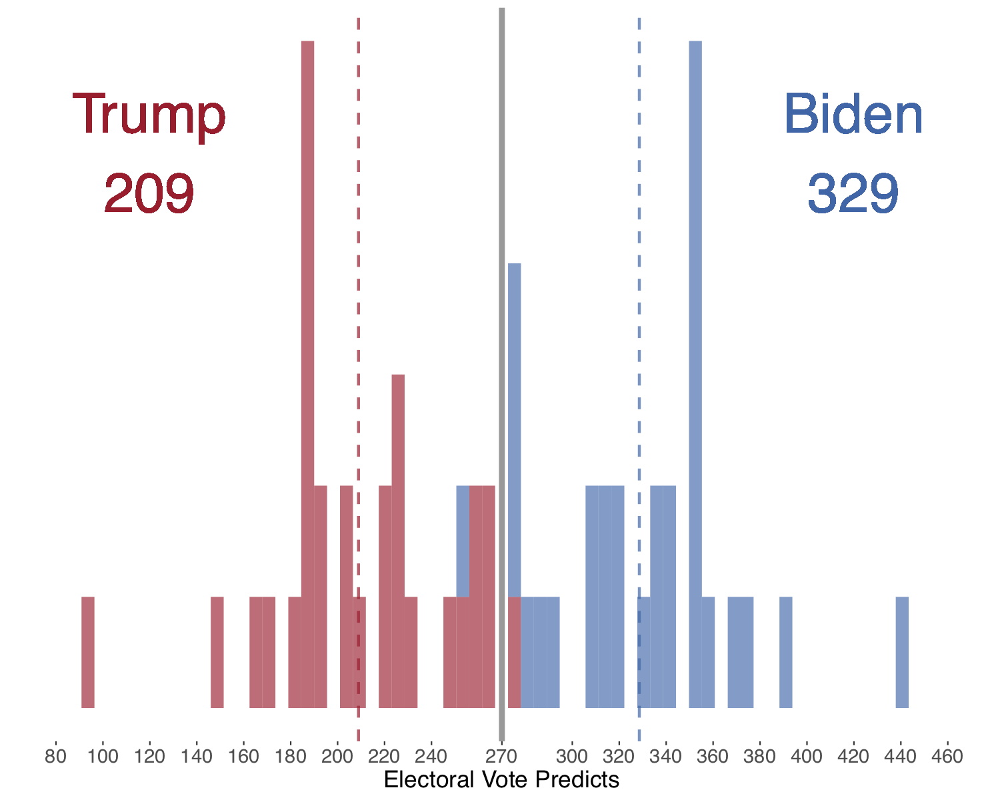
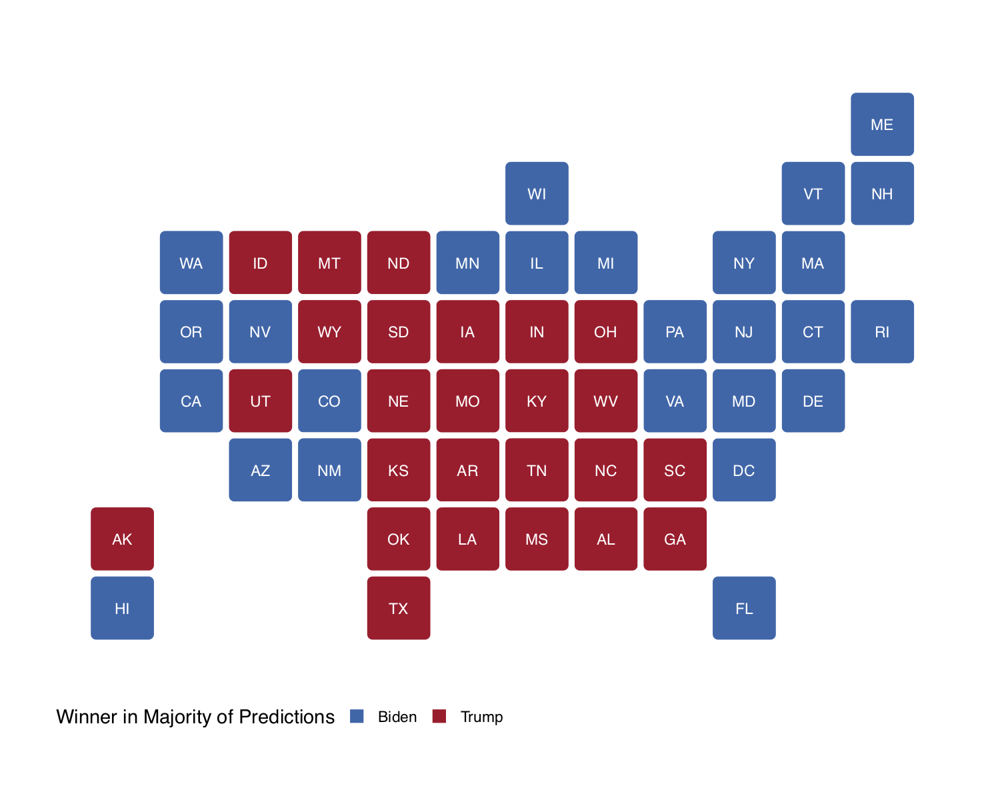
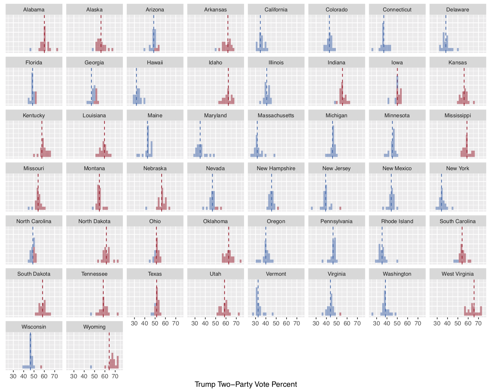

# Welcome! 

This webpage is a collection of election analytics blogs made by student forecasters in the course Gov 1347 at Harvard University (taught by Ryan Enos with teaching fellows Soubhik Barari and Sun Young Park). 

The goal of these blogs is to provide **descriptive analyses and regularly updated predictions around the outcome of the 2020 presidential election**. Forecasters use rigorous quantitative and statistical methods and political reseach to make scientifically-informed commentary around different facets of the race (e.g., the economy, ad campaigns). 

## Summary of forecasts

Below is a series of graphical and tabular summaries of our class's forecasts for the 2020 election. We can see from **Figure 1** that, overall, Biden is heavily favored to win the race with only <u>one</u> out of our 27 forecasts predicting that Trump will cross `270 EV`. 

<h3><b>Figure 1: Distribution of Gov 1347 Electoral College Forecasts</b></h3>

As we approach Election Day, Biden [appears to be ahead in the polls](https://projects.fivethirtyeight.com/polls/president-general/) by a `>5%` margin in some battleground states like Michigan, Wisconsin, and Pennsylvannia and barely ahead in other battlegrounds like Florida, Arizona, North Carolina, and Georgia. **Figure 2** shows that the majority of our forecasters predict that Biden will win in the battleground states of Florida, Arizona, Pennsylvannia, Michigan, New Hampshire and Wisconsin, while Trump will claim Georgia, North Carolina and Ohio. And yes, Texas as well.

<h3><b>Figure 2: Projected State Winners in Majority of Gov 1347 Forecasts</b></h3>

How certain are we about these forecasts? For forecasters who predicted state-level popular voteshares [^1], we certainly see some variance in these predictions ranging from `5-10%`. There seems to be considerable disagreement about Trump winning North Carolina and Georgia (and a surprising amount for Texas, with two forecasts predicting a historic flip). For Biden, there is similar, though slightly less, disagreement about Florida and Arizona though a solid consensus for New Hampshire, Michigan, and Pennsylvannia.

<h3><b>Figure 3: Distribution of Gov 1347 State-Level Two-Party Popular Vote Forecasts (for Trump)</b></h3>

Nevertheless, averaged together, the resulting map of state-level popular voteshares shown below in **Figure 4** sees a considerable amount of (literal) grey area. There may be consensus on the eventual winner of some major swing states, but the <u>mean</u> of these point predictions reveals very slim win margins for Biden.

<h3><b>Figure 4: Map of Average Gov 1347 State-Level Two-Party Popular Vote Forecasts (for Trump)</b></h3>

Taken together, Gov 1347 forecasts tell us that there will be a tight race ahead of us in the 24 hours -- or days -- to come.

For more state-by-state summary statistics, see [this table](states.html).

## Forecaster blogs

* [Alison Hu](http://ahu6.github.io/electionanalytics), Sophomore in Applied Math / Economics
* [Brendan Chapuis](https://bchaps1999.github.io/2020_election_analytics/), Junior in Economics
* [Carine Hajjar](https://carine-h.github.io/), Senior in Government (Data Science)
* [Cassidy Bargell](https://cassidybargell.github.io/election_analytics/), Junior in Integrative Biology
* [Christopher Milne](https://camilne9.github.io/election_analytics_blog/), Junior in Physics
* [Dominic Skinnion](https://dskinnion.github.io/Gov1347_Blog/), Sophomore in Government
* [Elias DeLeon](https://juggereggnog.github.io/Election-Analytics-Blog/), Sophomore in Philosophy / Government
* [Ella Michaels](https://ellamichaels.github.io/gov1347_blog/), Junior in Government
* [Eric White](https://eric-white2021.github.io/gov1347blog/), Senior in Applied Math
* [Erin Guetzloe](https://eguetzloe.github.io/Election-Analytics-Blog/), Sophomore in Government (Data Science) and Philosophy
* [Evangelos Kasus](https://ekassos.github.io/election-analytics/), Sophomore in Government
* [Evelyn Cai](http://caievelyn.github.io/election-analytics), Junior in Government
* [Feven Yohannes](https://fyohannes.github.io/Data_Elections/), Junior in Government
* [Grace Kim](https://gkim65.github.io/2020_ElectionBlogPost_gov1347/), Mechanical Engineering / Government (Data Science)
* [Jack Schroeder](https://jackmschroeder.github.io/Election-Analytics/), Senior in Government
* [Kayla Manning](https://kayla-manning.github.io/gov1347/), Sophomore in Statistics
* [Lindsey Greenhill](https://lindseygreenhill.github.io/Gov1347/), Sophomore in Government (Data Science)
* [Miroslav Bergam](https://mirobergam.github.io/Election-Analytics/), Freshman in Government
* [Nick Sigua](https://nick-sigua.github.io/Election_Analytics_Sigua/), Junior in Government
* [Nithin Kavi](https://thinkinavi24.github.io/ElectionAnalytics/), Freshman in Computer Science / Mathematics
* [Owen Bernstein](https://owenbernstein.github.io/), Sophomore in Government
* [Parker Mas](https://parkermas.github.io/gov1347-blog/), Junior in Government
* [Richard Brown](https://rbrown146.github.io/Gov_Election_Analytics/), Junior in Economics / Government
* [Samuel Lowry](https://samuellowry.github.io/gov1347_blog/), Sopmohore in Government / History
* [Samuel Thau](https://samthau.github.io/gov1347/), Junior in Applied Math and Government
* [Serhiy Sokhan](https://serhiys1.github.io/electionblog/), Senior in Government
* [Tahmid Ahmed](https://tahmidahmed2000.github.io/Gov1347/), Junior in Government and Economics
* [Yaodong Yu](https://itsyaoyu.com/blog/), Sophomore in Government (Data Science)

 

[^1]: Some forecasters simply predicted state-level winners, which accounts for some disrepancies between the average state-level predicted PVs in Figure 2 and the state-level winners in Figure 1.
